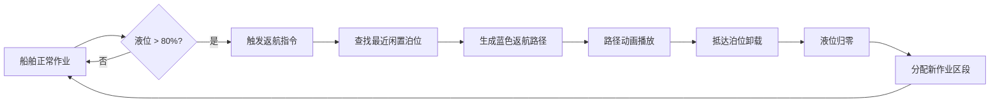
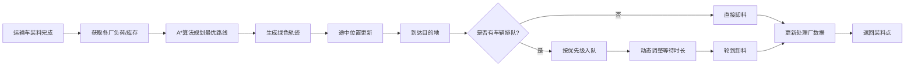
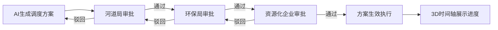

## 1. 产品概述

城市河道清淤与污泥资源化利用3D交互可视化调度平台，集成清淤船舶监控、运输调度、脱水处理、资源化利用、环保监控于一体的综合智能调度系统。目标用户包括河道管理作业员、河长、市级管理局三级人员，实现全流程数字化、可视化、智能化管控，提升清淤效率，保障资源化利用率，推动绿色环保可持续发展。

## 2. 核心功能

### 2.1 用户角色与权限

| 角色 | 登录方式 | 核心权限 |
|------|---------|----------|
| 作业员 | 人脸识别登录 | 查看分配任务、执行操作、记录作业日志 |
| 河长 | 人脸识别登录 | 监管区段河道、审批调度方案、查看报表数据 |
| 管理局 | 人脸识别登录 | 全局调度、三级审批最终决策、系统配置、导出报表 |

### 2.2 功能模块总览

1. **登录认证页**: 人脸识别模拟、权限选择、操作日志记录
2. **3D主场景页**: 河道全景、船舶模型、泊位、处理厂、监控中心、时间轴
3. **船舶详情弹窗**: 24小时清淤曲线、泵压数据图表、历史记录
4. **运输调度面板**: 车辆列表、最优路线规划、排队优先级管理
5. **设备监控面板**: 离心机转速动画、含水率、进料浓度、参数优化记录
6. **预测调度中心**: 5天清淤量预测、调度方案生成、三级审批流程
7. **库存管理中心**: 陶粒/肥料库存、安全阈值预警、补产审批
8. **报表导出页**: 季度报表、Excel导出、多维度数据分析

### 2.3 页面功能详情

| 页面名称 | 模块名称 | 功能描述 |
|----------|----------|---------|
| 登录认证页 | 人脸识别区 | 摄像头模拟扫描动画、人脸轮廓识别框、识别进度条 |
| 登录认证页 | 权限选择区 | 三级权限Tab切换、账号信息展示、登录按钮 |
| 登录认证页 | 日志记录 | 登录时间、IP、角色、操作记录写入日志系统 |
| 3D主场景页 | 河道地形 | 蜿蜒河道模型、水面波纹、沿岸建筑、绿化带 |
| 3D主场景页 | 清淤船舶 | 编号标签、作业区段、实时清淤量、液位百分比、位置移动 |
| 3D主场景页 | 返航系统 | 液位>80%触发返航、蓝色路径动画、最近闲置泊位分配 |
| 3D主场景页 | 中转泊位 | 4个泊位、占用/空闲状态、停靠船舶显示 |
| 3D主场景页 | 脱水处理厂 | 3座处理厂、处理负荷进度条、库存余量显示 |
| 3D主场景页 | 资源化车间 | 陶粒生产线、肥料生产线、产出设备动画 |
| 3D主场景页 | 环保监控中心 | 主楼建筑、监测天线、数据大屏模拟 |
| 3D主场景页 | 运输系统 | 运输车模型、绿色轨迹动画、自动避障、排队等待 |
| 3D主场景页 | 3D时间轴 | 底部横向时间轴、进度条、缩放控制、历史回放 |
| 船舶详情弹窗 | 清淤曲线 | ECharts折线图、24小时数据、区域选择 |
| 船舶详情弹窗 | 泵压数据 | 实时压力表、波动曲线、异常标记 |
| 船舶详情弹窗 | 基础信息 | 船舶参数、船员信息、维护记录 |
| 运输调度面板 | 车辆列表 | 车牌号、载重、目的地、状态、优先级标签 |
| 运输调度面板 | 路线规划 | 绿色轨迹动画、距离预估、到达时间计算 |
| 运输调度面板 | 排队管理 | 多车到达排序、等待时长动态调整、优先级算法 |
| 设备监控面板 | 离心机3D | 旋转速度联动动画、3D透视图、部件高亮 |
| 设备监控面板 | 参数监控 | 进料浓度、出泥含水率、转速、电流实时数值 |
| 设备监控面板 | 预警系统 | 含水率超标自动调转速、预警推送、参数优化记录列表 |
| 预测调度中心 | 预测图表 | 5天清淤量柱状图、历史对比折线、气象因子叠加 |
| 预测调度中心 | 方案生成 | 基于历史数据+气象预报的AI调度建议 |
| 预测调度中心 | 三级审批 | 河道局→环保局→资源化企业流程、审批状态、意见填写 |
| 库存管理中心 | 库存看板 | 陶粒、肥料库存数量、安全阈值红线、柱状图 |
| 库存管理中心 | 补产审批 | 低于阈值自动触发、审批流、产能预估 |
| 报表导出页 | 数据筛选 | 季度选择、指标勾选、区域选择 |
| 报表导出页 | 报表预览 | 清淤量、处理效率、资源化利用率表格+图表 |
| 报表导出页 | Excel导出 | xlsx文件下载、数据格式化、图表嵌入 |

## 3. 核心流程

### 3.1 船舶作业返航流程

操作员登录系统 → 查看3D场景中各船舶作业状态 → 某船液位达80% → 系统自动触发返航指令 → 计算最近闲置泊位 → 蓝色返航路径动画播放 → 船舶移动至泊位卸载 → 卸载完成液位归零 → 重新分配作业区段 → 船舶出发继续作业

### 3.2 运输调度流程

运输车装载完成 → 读取各处理厂负荷与库存 → 算法计算最优卸料厂 → 生成绿色运输轨迹 → 途中实时位置更新 → 到达处理厂检查队列 → 按优先级排队 → 动态调整等待时长 → 卸料完成 → 更新处理厂数据 → 返回装料点

### 3.3 调度方案三级审批流程

系统基于历史+气象生成预测方案 → 提交河道局初审 → 河道局审批通过/驳回 → 通过则提交环保局二审 → 环保局审批 → 通过则提交资源化企业终审 → 终审通过方案生效 → 3D时间轴展示执行进度

## 4. 用户界面设计

### 4.1 设计风格

- **主色调**: 深海蓝 `#0A1628`（背景）、科技青 `#00D4FF`（主强调）、生态绿 `#00FF88`（资源化/运输）、警示橙 `#FF8800`（预警）、安全红 `#FF3355`（超标）
- **辅色调**: 浅灰蓝 `#1A2D4A`（面板）、亮白 `#E8F4FF`（文字）、金色 `#FFD700`（审批高亮）
- **按钮风格**: 圆角8px、渐变边框、悬停发光效果、点击微缩放
- **字体**: 中文使用 `PingFang SC` / `Microsoft YaHei`，数字和英文使用 `Orbitron` / `JetBrains Mono` 等宽科技字体
- **布局风格**: 左侧功能导航栏 + 中央3D主场景 + 右侧信息面板 + 底部时间轴的工业控制中心布局
- **图标风格**: Lucide图标库配合自定义霓虹发光描边效果

### 4.2 页面设计概览

| 页面名称 | 模块名称 | UI元素设计 |
|----------|----------|-----------|
| 登录认证页 | 人脸识别区 | 深蓝渐变背景、居中圆形扫描框、上下扫描线动画、人脸轮廓虚线、百分比进度环、脉冲光圈 |
| 登录认证页 | 权限选择 | 三个权限卡片横向排列、选中态金框发光、头像占位、角色名称与职责描述 |
| 3D主场景页 | 整体布局 | 全屏3D画布、左上系统Logo+用户信息、左中竖向功能图标栏、右上KPI指标卡片组、右下船舶快捷列表、底部贯穿式时间轴 |
| 3D主场景页 | 船舶模型 | 小型3D船体、头顶浮动信息卡片（编号黑底+彩色数字、液位进度条、作业区段）、选中高亮光环、点击缩放聚焦 |
| 3D主场景页 | 路径动画 | 返航路径用蓝色发光渐变曲线、粒子流动效果；运输路径用绿色流动虚线、方向箭头粒子 |
| 3D主场景页 | 建筑模型 | 处理厂用灰蓝工业风建筑+烟囱冒烟粒子、车间用玻璃幕墙+内部设备灯闪烁、监控中心用半球形雷达+旋转扫描线 |
| 3D主场景页 | KPI卡片组 | 4张半透明玻璃拟态卡片：总清淤量(青)、处理效率(绿)、利用率(金)、预警数(红)、带趋势小箭头 |
| 船舶详情弹窗 | 图表区 | 左侧24h清淤曲线（渐变填充面积图）、右侧泵压双Y轴图、底部参数网格、带毛玻璃背景 |
| 运输调度面板 | 列表项 | 每行：车牌号+状态徽章、载重进度条、目的地标签、倒计时、优先级1-3星标、hover展开路线预览 |
| 设备监控面板 | 离心机区 | 左半3D离心机透视图（透明外壳+内部螺旋转子旋转）、右半参数仪表盘组（半圆仪表+指针动画）、下方预警日志时间线 |
| 预测调度中心 | 审批流 | 顶部横向三级审批节点（连接线+状态圆点）、中间方案详情卡、底部5天预测柱状图（可点击日切换方案） |
| 库存管理中心 | 库存看板 | 两个大数字卡片（陶粒/肥料）+环形进度、安全阈值红线标记、右侧补产申请表单+审批状态列表 |
| 报表导出页 | 配置与预览 | 左侧筛选区（季度下拉、指标多选、导出按钮）、右侧大表格预览+内嵌迷你图表、行高条纹、hover高亮 |

### 4.3 响应式设计

- 桌面端优先（≥1920×1080）：完整3D场景+全功能面板展开
- 笔记本端（1366×768～1600×900）：面板紧凑模式、部分面板可折叠
- 平板端：竖向导航收起为图标、面板切换为Tab模式、3D场景自适应缩放

### 4.4 3D场景设计指引

- **环境与氛围**: 黄昏/暮色蓝调时刻，HDRI使用柔和城市环境贴图，雾气营造纵深，整体冷色调辅以暖色建筑灯光，营造智慧水务控制中心科技感
- **光照设置**: 主方向光（模拟夕阳，橙色偏暖，强度0.6）+ 环境半球光（天空深蓝/地面暗蓝）+ 点光源补光（建筑窗户、船舶航行灯、泊位灯塔）
- **相机设置**: 初始为45°俯瞰透视视角，目标点位于场景中心；支持轨道控制（OrbitControls）：缩放0.5x～3x，俯仰角10°～80°；点击船舶可平滑飞行聚焦（camera.flyTo）
- **构图与焦点**: 河道呈S形从左上延伸至右下作为视觉主轴，船舶分布在河道各段，处理厂与车间集中在右下方工业区，监控中心位于右上角制高点作为视觉锚点
- **交互与动画**: 船舶沿河道曲线平滑移动（CatmullRomCurve3）；液位进度条实时填充；返航时蓝色CurveTube发光+粒子流；离心机转子按转速值真实旋转；水面Shader波浪动画；监控雷达扫描线旋转；所有过渡使用spring弹性缓动
- **后处理效果**: Bloom泛光（阈值0.8，强度0.6，所有发光元素）、轻微Vignette暗角、FXAA抗锯齿、ToneMapping色调映射（ACES）、Contrast对比度微调
- **性能预算**: 面数控制在15万面以内；使用InstancedMesh复用船舶/车辆模型；LOD分级远处简化；DrawCall<100；帧率目标60fps（最低30fps）

