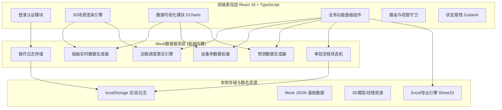

## 1. 架构设计



## 2. 技术选型说明

- **前端框架**: React@18 + TypeScript@5 + Vite@5
- **初始化工具**: vite-init（react-ts模板，内含react-router-dom、tailwindcss@3、zustand）
- **后端服务**: 无后端，采用前端内置Mock数据服务层模拟真实业务逻辑
- **3D可视化栈**:
  - `three@0.160`: 底层WebGL 3D引擎
  - `@react-three/fiber@8`: React-Three.js桥接渲染器
  - `@react-three/drei@9`: 3D常用组件库（控制器、文字、曲线等）
  - `@react-three/postprocessing@2`: 后期处理（Bloom泛光等）
- **图表可视化**: `echarts@5` + `echarts-for-react`
- **Excel导出**: `xlsx@0.18`（SheetJS社区版）
- **UI图标**: `lucide-react`
- **样式方案**: TailwindCSS@3 + 自定义CSS变量主题

## 3. 路由定义

| 路由路径 | 页面组件 | 用途说明 | 权限要求 |
|----------|---------|----------|---------|
| `/login` | Login | 人脸识别登录、角色选择 | 公开 |
| `/dashboard` | Dashboard | 3D主场景调度中心（首页） | 作业员/河长/管理局 |
| `/ships` | ShipManagement | 船舶列表与详情管理 | 作业员及以上 |
| `/transport` | TransportDispatch | 运输调度与路线规划 | 作业员及以上 |
| `/equipment` | EquipmentMonitor | 脱水离心机设备监控 | 作业员及以上 |
| `/forecast` | ForecastSchedule | 5天预测与调度方案审批 | 河长及以上 |
| `/inventory` | InventoryControl | 资源化产品库存与补产审批 | 河长及以上 |
| `/reports` | ReportExport | 季度报表生成与Excel导出 | 管理局 |
| `*` | NotFound | 404重定向到登录页 | - |

## 4. 核心数据类型定义

```typescript
// ========== 基础枚举 ==========
export type UserRole = 'operator' | 'river_chief' | 'administrator';
export type ShipStatus = 'working' | 'returning' | 'docking' | 'idle';
export type BerthStatus = 'occupied' | 'idle';
export type TruckStatus = 'loading' | 'transporting' | 'queuing' | 'unloading' | 'returning';
export type ApprovalStatus = 'pending' | 'approved' | 'rejected';
export type CentrifugeStatus = 'running' | 'warning' | 'stopped';

// ========== 用户系统 ==========
export interface User {
  id: string;
  name: string;
  role: UserRole;
  avatar?: string;
  department: string;
}

export interface OperationLog {
  id: string;
  userId: string;
  userName: string;
  role: UserRole;
  action: string;
  timestamp: number;
  ip: string;
  details: string;
}

// ========== 船舶系统 ==========
export interface DredgeShip {
  id: string;
  shipNo: string;
  status: ShipStatus;
  position: [number, number, number];
  targetPosition?: [number, number, number];
  workSection: string;
  currentDredgeVolume: number;
  tankLevel: number;
  totalCapacity: number;
  pumpPressure: number;
  crewCount: number;
  hourlyData: DredgeHourData[];
  assignedBerthId?: string;
  returnPath?: [number, number, number][];
}

export interface DredgeHourData {
  hour: number;
  volume: number;
  pressure: number;
}

export interface Berth {
  id: string;
  name: string;
  status: BerthStatus;
  position: [number, number, number];
  dockedShipId?: string;
}

// ========== 处理厂系统 ==========
export interface TreatmentPlant {
  id: string;
  name: string;
  position: [number, number, number];
  processingLoad: number;
  maxLoad: number;
  inventory: number;
  maxInventory: number;
  centrifugeIds: string[];
}

export interface Centrifuge {
  id: string;
  plantId: string;
  name: string;
  status: CentrifugeStatus;
  feedConcentration: number;
  outletMoisture: number;
  standardMoisture: number;
  rotationSpeed: number;
  targetSpeed: number;
  current: number;
  optimizationRecords: OptimizationRecord[];
}

export interface OptimizationRecord {
  id: string;
  timestamp: number;
  beforeSpeed: number;
  afterSpeed: number;
  beforeMoisture: number;
  reason: string;
  operator: string;
}

// ========== 运输系统 ==========
export interface TransportTruck {
  id: string;
  plateNo: string;
  status: TruckStatus;
  position: [number, number, number];
  loadWeight: number;
  maxLoad: number;
  priority: 1 | 2 | 3;
  originId: string;
  targetPlantId: string;
  routePath: [number, number, number][];
  estimatedArrival: number;
  waitTime: number;
}

// ========== 预测与审批系统 ==========
export interface ForecastDay {
  date: string;
  forecastVolume: number;
  historicalVolume: number;
  weatherFactor: number;
  weatherType: '晴' | '多云' | '小雨' | '大雨';
  temperature: [number, number];
}

export interface SchedulePlan {
  id: string;
  name: string;
  createdAt: number;
  period: [string, string];
  forecastData: ForecastDay[];
  shipAssignments: { shipId: string; dayVolume: number }[];
  approvalStep: 0 | 1 | 2 | 3;
  riverBureauApproval: ApprovalItem;
  envBureauApproval: ApprovalItem;
  resourceEnterpriseApproval: ApprovalItem;
  status: 'draft' | 'approving' | 'approved' | 'rejected' | 'executing';
  executionProgress: number;
}

export interface ApprovalItem {
  status: ApprovalStatus;
  approver?: string;
  comment?: string;
  approvedAt?: number;
}

// ========== 库存系统 ==========
export interface ProductInventory {
  id: string;
  productName: '陶粒' | '肥料';
  currentStock: number;
  safetyThreshold: number;
  maxCapacity: number;
  dailyOutput: number;
  weeklyDemand: number;
  replenishmentPlans: ReplenishmentPlan[];
}

export interface ReplenishmentPlan {
  id: string;
  productId: string;
  targetQuantity: number;
  estimatedDays: number;
  approvalStatus: ApprovalStatus;
  approver?: string;
  createdAt: number;
  approvedAt?: number;
}

// ========== 报表系统 ==========
export interface QuarterlyReport {
  quarter: string;
  year: number;
  totalDredgeVolume: number;
  avgProcessingEfficiency: number;
  avgResourceUtilization: number;
  monthlyBreakdown: {
    month: string;
    dredgeVolume: number;
    processingEfficiency: number;
    resourceUtilization: number;
  }[];
  plantBreakdown: {
    plantName: string;
    processedVolume: number;
    efficiency: number;
    ceramicOutput: number;
    fertilizerOutput: number;
  }[];
}
```

## 5. 状态管理（Zustand Store）结构

```typescript
// stores/useAppStore.ts
export interface AppState {
  // 用户
  currentUser: User | null;
  login: (role: UserRole, name: string) => Promise<boolean>;
  logout: () => void;
  
  // 3D交互
  selectedShipId: string | null;
  selectedTruckId: string | null;
  selectedCentrifugeId: string | null;
  timeRange: [number, number];
  isPlayingTimeline: boolean;
  setSelectedShip: (id: string | null) => void;
  
  // 业务数据（均含模拟tick更新）
  ships: DredgeShip[];
  berths: Berth[];
  plants: TreatmentPlant[];
  centrifuges: Centrifuge[];
  trucks: TransportTruck[];
  plans: SchedulePlan[];
  inventories: ProductInventory[];
  logs: OperationLog[];
  
  // Actions
  triggerShipReturn: (shipId: string) => void;
  dispatchTruck: (truckId: string, plantId: string) => void;
  adjustCentrifugeSpeed: (id: string, newSpeed: number) => void;
  approvePlan: (planId: string, step: number, pass: boolean, comment: string) => void;
  createReplenishment: (productId: string, qty: number) => void;
  exportReport: (year: number, quarter: number) => Blob;
  
  // 仿真tick
  tickSimulation: (deltaMs: number) => void;
}
```

## 6. 项目目录结构

```
src/
├── components/
│   ├── 3d/                     # 3D场景相关组件
│   │   ├── Scene3D.tsx         # 主场景Canvas
│   │   ├── River.tsx           # 河道与水面
│   │   ├── DredgeShip3D.tsx    # 单艘清淤船模型
│   │   ├── Berth3D.tsx         # 泊位模型
│   │   ├── TreatmentPlant3D.tsx# 处理厂建筑群
│   │   ├── Workshop3D.tsx      # 资源化车间
│   │   ├── MonitorCenter3D.tsx # 监控中心
│   │   ├── Truck3D.tsx         # 运输车模型
│   │   ├── Centrifuge3D.tsx    # 离心机3D模型
│   │   ├── PathLine.tsx        # 通用路径动画线
│   │   └── Lights.tsx          # 场景光照
│   ├── ui/                     # 通用UI组件
│   │   ├── GlassCard.tsx
│   │   ├── NeonButton.tsx
│   │   ├── Gauge.tsx           # 半圆仪表盘
│   │   ├── ProgressRing.tsx    # 环形进度
│   │   ├── DataTable.tsx
│   │   ├── KpiCard.tsx
│   │   └── Timeline3D.tsx      # 底部时间轴
│   ├── panels/                 # 右侧功能面板
│   │   ├── ShipDetailPanel.tsx
│   │   ├── TransportPanel.tsx
│   │   ├── EquipmentPanel.tsx
│   │   ├── ForecastPanel.tsx
│   │   ├── InventoryPanel.tsx
│   │   └── ReportPanel.tsx
│   └── layout/
│       ├── SideNav.tsx
│       ├── TopBar.tsx
│       └── KpiGroup.tsx
├── pages/
│   ├── Login.tsx
│   ├── Dashboard.tsx
│   ├── ShipManagement.tsx
│   ├── TransportDispatch.tsx
│   ├── EquipmentMonitor.tsx
│   ├── ForecastSchedule.tsx
│   ├── InventoryControl.tsx
│   └── ReportExport.tsx
├── hooks/
│   ├── useSimulation.ts        # 仿真循环hook
│   ├── useShipAI.ts            # 船舶智能返航
│   ├── useRoutePlanning.ts     # A*路径规划
│   └── usePermission.ts        # 权限守卫
├── stores/
│   └── useAppStore.ts
├── utils/
│   ├── mock/                   # Mock数据生成器
│   │   ├── shipData.ts
│   │   ├── truckData.ts
│   │   ├── centrifugeData.ts
│   │   ├── forecastData.ts
│   │   └── reportData.ts
│   ├── algorithms/
│   │   ├── routePlanner.ts     # A*寻路
│   │   ├── scheduler.ts        # 调度算法
│   │   └── queueManager.ts     # 排队优先级
│   ├── excel/
│   │   └── reportExporter.ts   # Excel导出工具
│   └── theme/
│       └── colors.ts
├── types/
│   └── index.ts                # 全局类型定义
├── App.tsx
├── main.tsx
└── index.css
```

